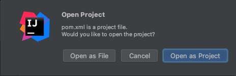

# Step 0

## Installing an IDE
The first thing we need to do is download an Integrated Development Environment (IDE) which is the software we will use to build our application.

In this exercise, we will be assuming that you are using IntelliJ IDEA. You are welcome to use a different IDE if you are already familiar with one, but otherwise we recommend that you use IntelliJ.

You can download the IntelliJ IDEA Community edition at https://www.jetbrains.com/idea/download/

## Generating the Project
Before we start, we need to get a project setup. You *could* fork this repository, but it's useful to know how we create it from scratch. Spring (the framework we're using to build this service) has a handy tool for generating projects at https://start.spring.io/. We'll use this to generate our project.  

The image above shows all the options used to setup this project. Some notable options include the possibility for this to be a Kotlin project instead of Java (you're more than welcome to give this a go), as well as the build system we're using (Maven/Gradle) and the version of Java we want to use. We've also added the `Spring Web` dependency - this will become useful later.

When you click **GENERATE**, you will download a ZIP of the project. Unzip this wherever you would like to store it. Then, in IntelliJ, you can use the `File -> Open` option to locate your project. The easiest way for IntelliJ to see this as a Java project, rather than just a collection of files is to use this dialog to open the `pom.xml` file. You should get a popup asking if you'd like to open it as a project or a file - choose project.

### What's a pom.xml anyway?
The pom.xml, put simply, is the set of instructions for our build system (Maven) to use when executing certain 'goals'. For example, telling it what parts of the project to build and how. We also use it to manage our dependencies. If you're familiar with NPM in the Javascript world, you can think of it as a more complex `package.json` file.

For more information, see the [pom.xml documentation on Maven's site](https://maven.apache.org/guides/introduction/introduction-to-the-pom.html).

## Running the Project
When we setup the project in Spring Initializr, we selected Java 17 as our Java version - but unless you've already set up you probably won't have a version of the Java SDK on your system. Luckily, IntelliJ makes it really easy to set up.
If you click `File -> Project Structure` you can see how the project is configured. If you've not got a project SDK selected as Java 17, click edit.

Click the '+' button on the next page to add a JDK, and choose `Download JDK`. Set the version to 17, and pick which distribution you'd like to download - it doesn't matter too much which you go for, though Amazon Coretto is a popular choice.

IntelliJ gives you lots of options when it comes to running your application, but as we just want to check everything's working for now, we'll do it the quick way. Go to the `LightningLunchBackendApplication.java` file (you can use CMD+O to jump straight to classes by name). When the file's open, you should see a green 'play' button by the side of the code, click that, and select 'Run'.

The application should then build and run, and you'll see some output in the console showing that Spring has started! Your application doesn't do anything yet, but at least we know it's working!
## So what files/folders have we ended up with?
**src/** - This contains the source code of your application. In the Java folder we've got `LightningLunchBackendApplication.java`, the entry point into our application. We've also got a resources folder which is where we'd place any resources we need access to from within the application. Pre-generated for us is an `application.properties` file. This lets us set configuration options in the project to use throughout the application. [See the Spring Docs on application.properties files](https://docs.spring.io/spring-boot/docs/current/reference/html/application-properties.html).

**.gitignore** - We don't always want to commit every file to Git. This files tells Git which files should be excluded. [See the Git-SCM docs on .gitignore files](https://git-scm.com/docs/gitignore)

**.mvn/, mvnw, mvnw.cmd** - These files/folders are used for the Maven Wrapper. They're everything we need to build the project using Maven. [See the Maven docs on the Maven Wrapper](https://maven.apache.org/wrapper/)

**.idea/, lightning-lunch-backend.iml** - You'll only have these if you're using IntelliJ. They store your IDE specific settings (which is why it's in the .gitignore)

So that's Step 0 done! Hopefully, your project should now look like the `main` branch does (though probably without a `README.md`). If not, please reach out and ask for help, or if you're really turned around, you can fork/clone this repo to put you at the same point ready for step 1!
