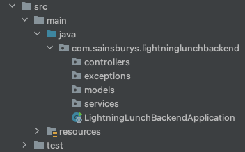

# Step 1
## Interlude - What's an API
An API (application programming interface) is a really loose term for *some way* for programs to communicate. In this context, we're building a service for the UI application we build later to get data from, and send data to. These type of APIs are all over the place - there's hundreds (if not thousands) of them in Sainsbury's, and examples everywhere you look in the real world.  
  
There are lots of different ways of doing this, but for this project, and a lot of the services we build in Sainsbury's, we'll be using [REST](https://restfulapi.net/). It's a standard interface, and there's loads of examples of REST APIs that you can play with, often for free, like the [dog api](https://dog.ceo/dog-api/)!
### What's Spring's role in this?
Spring is a Java framework that makes creating APIs really easy. You don't have to use it, but a lot the hard work is already taken care of. In step 0 we chose to add "Spring Web" as a dependency - but there are loads of other easy add-ons depending on what you're working on.  
  
There are many different API frameworks in all different languages, some you might have heard of include:  
* Express (Javascript)
* Django REST (Python)
* Flask (Python)
* Rails (Ruby)
* Ktor (Kotlin)

### Spring Concepts
You could write a whole book on the concepts of working with Spring (and in fact, many people have!). The documentation is also publicly available [here](https://docs.spring.io/spring-framework/docs/3.0.x/spring-framework-reference/html/overview.html). A lot of these concepts may be different to what you're used to - although Java is an [object-oriented](https://www.w3schools.com/java/java_oop.asp) language, Spring makes heavy use of [dependency injection](https://www.baeldung.com/spring-dependency-injection) to create what are called [beans](https://stackoverflow.com/questions/17193365/what-in-the-world-are-spring-beans). These are essentially singletons (single instance objects) to manage parts of your service.
    
Working through this project, we'll try and explain the concepts you're using as you go, but some of them really aren't easy to get your head around. **Please take the time to read up on concepts, or ask for help as you go along if there's something you don't understand!**

## Let's set up our code packages
So, we know a little bit about how Spring works now, and what we're going to try and build. Let's set up the package structure for our project. It's really important as you work on larger projects that you pick something sensible that engineers who come and go across the lifespan of a project will understand.
  
Within `src/main/java/com.sainsburys.lightninglunchbackend` we're going to make the following packages:  
  
**controllers** - Controllers are essentially the entry points into our application, they're where we'll define how our consumers can request or send data to our service.  
  
**models** - Models are how we represent the data in our application. It's important that the data structure, for example of a product, remains consistent throughout the application, or our consumers might not get data they request in the format they expect!  
  
**services** - Services are where we'll handle the business logic of our application. For example a basket service might handle pricing the items in a customer's basket, taking into account business rules like promotions.  
  
**exceptions** - This is tech, things can and will go wrong! We can use exceptions to gracefully handle failure scenarios rather than crashing and burning.

When you're done, your `src` folder should look like this:  
  

## Let's write a controller!
As we mentioned above, controllers are the entrypoints into our application. For now, we're just going to create a test controller to see how it works. In your `controllers` package, create a new class: `TestController`. You should notice that the class definition has been created for you - it should look like this:
```java
package com.sainsburys.lightninglunchbackend.controllers;

public class TestController {
}
```  
### Adding annotations
Next, we need to add a couple of [annotations](https://www.geeksforgeeks.org/annotations-in-java/) to tell Spring some things about this class. We can add the following just above the **class definition** (`public class ...{}`):  
  
`@RestController` - This tells Spring that our class is a Rest Controller. If we didn't have any kind of annotation to tell Spring what it is, it would be outside the Spring context, and essentially just be a normal Java class. By bringing the class into Spring's management, the Spring framework will handle the instantiation of this class as a bean so it can be used throughout the lifecycle of the application.  
  
`@RequestMapping("test")` - This helps us create sensible paths for requests to our service. For example, we might have `api.sainsburys.co.uk/orders` and `api.sainsburys.co.uk/products`. In this case, we're telling Spring that we want everything in this class to be mapped to the path `/test`.

### Creating a method
#### Refresher on Java Methods
Let's give our controller something to do, but first, let's brush up on what functions look like in Java. Most functions use the same building blocks, let's take the example in `LightningLunchBackendApplication.java`:  
**This code snippet is an example from our existing project, don't copy it into the controller!**
```java
public static void main(String[] args){}
```
*public* is the visibility of the function. Public means it can be accessed from other classes.  
  
*static* is a keyword that means the method belongs to the class rather than the instance of the class. We won't be using this very much.  
  
*void* is the return type of the function. We could return anything we want, but if we want to return nothing we use void.  
  
*main* the name of our function.  
  
*String[] args* the paramater the function accepts. In this case accepting an array of strings (`String[]`) with the name args.  

#### Controller method
Let's make a method in our TestController called `helloWorld`. It's going to return a Spring object called a [ResponseEntity](https://docs.spring.io/spring-framework/docs/current/javadoc-api/org/springframework/http/ResponseEntity.html), and take parameter of a String called `text`. As for what the method does, we want it to return a ResponseEntity status of OK, along with the `text` parameter we defined. Take a look at the docs and see if you can work out what you need to do!
<details>
    <summary>Give it a go yourself, and then open this spoiler to see the code!</summary>

```java
public ResponseEntity<?> helloWorld(String text) {
    return ResponseEntity.ok(text);
}
```
</details>

So that's the method written, but there's a few annotations we need to add to tie it all together. We're using `text` as a parameter, but Spring needs to know how to pass it into the function. If we add `@GetMapping("{text}")` above the function defenition, Spring will know that anything after `/test/` is our `text`. Now we just need to make sure it's tied to the parameter. We can preface our parameter (`String text`) with `@PathVariable("text")` to make sure that Spring passes it all the way through.  
  
The whole class should now look like below (imports have been left out):
<details>
    <summary>TestController.java</summary>

```java
@RestController
@RequestMapping("test")
public class TestController {

    @GetMapping("{text}")
    public ResponseEntity<?> helloWorld(@PathVariable("text") String text) {
        return ResponseEntity.ok(text);
    }
}
```
</details>

### Let's test it!
Run your application, and once it's running you should be able to go http://localhost:8080/test/anytexthere and see that text right back at you! If you're having problems, do reach out and we'll see if we can help. This is also a good time to look at tools like [Postman](https://www.postman.com/) which are useful when working with APIs. It's easy to use the browser when we're calling routes that just return us data, but if we wanted to securely send data to an API, we probably wouldn't want to send it in the URL like we did here! 

## Had any issues?
In the first instance, please reach out for help, or go back through the steps. If you've really got muddled, you can find a version of the code up to here on the [`step-1-code`](https://github.com/sainsburys-tech/jumpstart-induction-backend/tree/step-1-code) branch of the repo.