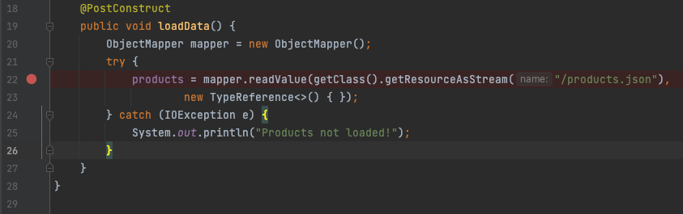
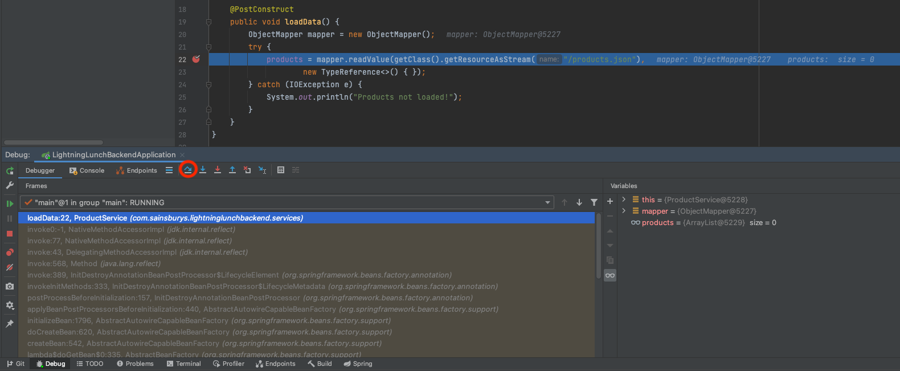
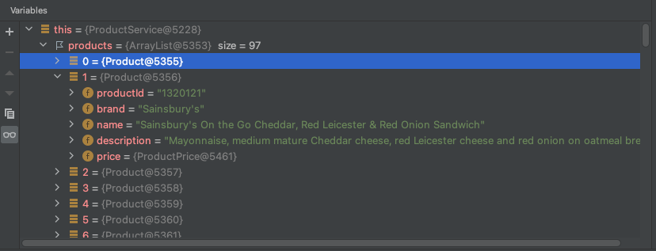

# Step 2
## Adding some products!  
So we've got our first controller - we want to repurpose it later to return product data, but first of all we need to create a representation of a product in our application.

In our `models` package, create a `Product` class. We're going to be returning products (and all other data) to our consumers in a [JSON](https://www.json.org/json-en.html) format. A single product will look like this:
```json
  {
  "productId": "3525289",
  "brand": "McCoy's",
  "name": "McCoy's Flame Grilled Steak Crisps 47.5g",
  "description": "Flame Grilled Steak Flavour Potato Crisps",
  "price": { "price": 0.9, "mealDeal": true }
}
```

### Creating our Product model

Because Java is [statically typed](https://developer.mozilla.org/en-US/docs/Glossary/Static_typing), we need to create a class that represents the data we want to use within our application - that's what our Product model is for. To define our product, we need to specify what values a product will have. For example, the first member variable we can add is the `productId`:
```java
public class Product {
    private String productId;
}
```
We're saying here that every Product will have a field called `productId` that will be a string. We're also defining it as `private` - meaning that other parts of the application won't be able to access this field, but we'll fix that later.  
  
Have a go at adding the rest of the fields yourself!

#### What about the price object?
If you've followed the example above for the other string elements, your class will probably look something like this:

<details>
    <summary>Product class without the Price object</summary>

```java
public class Product {
    private String productId;
    private String brand;
    private String name;
    private String description;
}
```
</details>

So because price isn't just a field, and is an object containing more fields, how do we define this in our class? There are multiple ways to do this, but we're going to create a second model for the product price object.  
  
Make a class called `ProductPrice` in the models package, and create the member variables for it like we did the Product.

<details>
    <summary>ProductPrice class</summary>

```java
public class ProductPrice {
    private float price;
    private boolean mealDeal;
}
```
</details>

Now that we have a way of representing a Product Price, we can add that field to our `Product` class, so our Product class should now look like this:

<details>
    <summary>Product class</summary>

```java
public class Product {
    private String productId;
    private String brand;
    private String name;
    private String description;
    private ProductPrice price;
}
```
</details>

### Getters and Setters
If all of our fields are private, how are we going to access them? This is where [getters and setters](https://www.baeldung.com/java-why-getters-setters) come into play. These are simply functions that retrieve or update a member variable - sometimes with additional validation or logic within them.   
  
We mentioned functions in the previous step - and that's all getters and setters are. A getter function will return the same type as the value you're retrieving and generally take no parameters, for example:

```java
    public String getProductId() {
        return productId;
    }
```

A setter, on the other hand, will take a parameter of the type of the value you're setting, and return `void`. For example:  

```java
    public void setProductId(String productId) {
        this.productId = productId;
    }
```

Try creating getters and setters for both the `Product` and `ProductPrice` classes!  

**Hint** - *IntelliJ has a "Generate Code" function that can help with getters and setters*

<details>
<Summary>Product class</Summary>

```java
public class Product {
    private String productId;
    private String brand;
    private String name;
    private String description;
    private ProductPrice price;

    public String getProductId() {
        return productId;
    }

    public void setProductId(String productId) {
        this.productId = productId;
    }

    public String getBrand() {
        return brand;
    }

    public void setBrand(String brand) {
        this.brand = brand;
    }

    public String getName() {
        return name;
    }

    public void setName(String name) {
        this.name = name;
    }

    public String getDescription() {
        return description;
    }

    public void setDescription(String description) {
        this.description = description;
    }

    public ProductPrice getPrice() {
        return price;
    }

    public void setPrice(ProductPrice price) {
        this.price = price;
    }
}
```

</details>

<Details>
<Summary>ProductPrice class</Summary>

```java
public class ProductPrice {
    private float price;
    private boolean mealDeal;

    public float getPrice() {
        return price;
    }

    public void setPrice(float price) {
        this.price = price;
    }

    public boolean isMealDeal() {
        return mealDeal;
    }

    public void setMealDeal(boolean mealDeal) {
        this.mealDeal = mealDeal;
    }
}
```
</Details>

#### That's a lot of boilerplate!

### Product Service
Now we have a representation in code of what our product might look like, we can use them in our project. Ordinarily, we might pull products from a database or another API, but for this demo project we're going to import them from a JSON file.  
  
In the `src/main/resources` you will find a file called `products.json` - copy that file into the same place in your project.

We need a way to interact with the products in our application. In the `services` package, create a `ProductService` class.  
We're going to use another annotation to bring this `ProductService` into the Spring context, a bit like we did for our test controller using the `@RestController` annotation.  As this is a service, we're going to use the `@Service` annotation. Just like the controller, this will make this class a bean, meaning Spring will create an instance of this class when it starts up. It will be the only instance of this class throughout the lifecycle of the application, which makes it an appropriate place to keep an in-memory list of products. We can define a list of products as a member of this class:
```java
@Service
public class ProductService {

    private List<Product> products = new ArrayList<>();
}
```
What we've done here is create a (private) variable called `products`. It's a `List`, and that list can only contain instances of our `<Product>` class. We then create an empty `ArrayList<>()` to assign to it.

### Importing the Products
Now we want to fill that products list with all of the products in our `products.json` file. To do this we're going to use an `ObjectMapper` to read the JSON file and convert them into `Product` instances.  
  
Create a `loadData()` function as outlined below:

```java
    public void loadData() {
        ObjectMapper mapper = new ObjectMapper();
        try {
            products = mapper.readValue(getClass().getResourceAsStream("/products.json"),
                    new TypeReference<>() { });
        } catch (IOException e) {
            System.out.println("Products not loaded!");
        }
    }
```
Don't worry too much if you don't understand how it works, we can come back to that later, but there are a few things we're doing here that are worth knowing about:

#### Try Catch
The try catch block is a way that allows us to handle any exceptions that are thrown by our code in a nice way that doesn't involve crashing the application. In this instance the readValue() method inside the try block (indicated by the braces) can throw an IOException if it encounters problems reading from our source.
Without the try catch block, this would crash the entire service if the exception was thrown which is far from ideal, however with it we can explicitly do something when that exception occurs.
Note: It is possible for you to catch multiple exceptions in one try catch block by appending more catch clauses.

#### System.out.println
This code simply outputs a message from the application, usually to the terminal it is running from. In this instance it is being used as a method of error logging. There are many other ways to log errors that are much better than this (which I'm sure you'll encounter in your teams) but we won't concern ourselves with that here.

We're only missing one thing to be able to load our products - we're not calling the `loadData()` function anywhere. For now, we only want to load the products when the application starts up. There's another annotation that can help with that: `@PostContruct` will call the function it's applied to once the beans have been setup. More info [here](https://www.baeldung.com/spring-postconstruct-predestroy).  
  
Here's what your class should look like now:
<Details>
<Summary>ProductService</Summary>

```java
@Service
public class ProductService {

    private List<Product> products = new ArrayList<>();

    @PostConstruct
    public void loadData() {
        ObjectMapper mapper = new ObjectMapper();
        try {
            products = mapper.readValue(getClass().getResourceAsStream("/products.json"),
                    new TypeReference<>() { });
        } catch (IOException e) {
            System.out.println("Products not loaded!");
        }
    }
}
```

</Details>

### Seeing if the products load
IntelliJ includes a [debugger](https://www.jetbrains.com/help/idea/debugging-code.html) that we can use to pause and inspect what's going on in our application as it's running. As our application doesn't have anything built in to tell us that the products have loaded, we can use the debugger to inspect our application.  
Place a debug point on the line where we're assigning the list of products as below:
  

Next, run your application with the debugger. It's the button that looks like a bug next to the run button. You should notice that your application will run up to the line we placed the debug point on, and you can see some details about it in the panel at the bottom.  
  

If you click the "Step Over" button (circled), the application will continue on to the point in the application after that line has been run. You should notice now that in the variables section, if you expand `this.products`, you'll see the full list of products from the JSON!  

