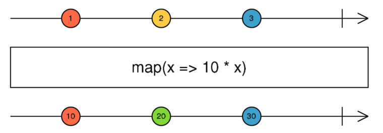
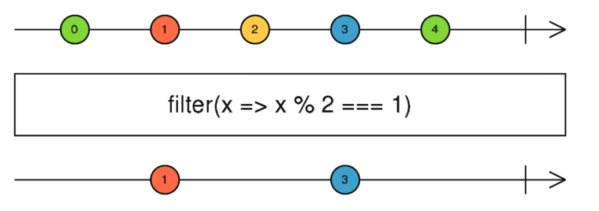
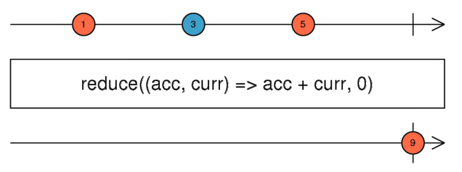

## Functional programming & Java streams
As the name suggests, functional programming is an approach to writing programs using functions.
Some languages like haskell are pure functional programming languages, but this concept has arrived in other languages.

In Java we can use streams to make use of functional-style operators. Simply put, streams are wrappers around a data source,
allowing us to operate with that data source and making bulk processing convenient and fast. Do note that a stream does
not store data, nor does it modify its data source.

You can [read a lot more](https://www.baeldung.com/java-8-streams-introduction) on java streams, however for this project
we're not going to require an understanding of them.


### Map, Filter, and Reduce
Three of the more common methods from functional programming are Map, Filter, and Reduce. One common diagram used to
demonstrate functional-like methods are marble diagrams.
The line atop represents the data source, the line below the outputted stream, and the arrow the direction of the data.

**Map** takes each object in the stream, transforms it in some way, and outputs each transformed object in order.


**Filter** takes each object in the stream, compares it against some condition, and outputs only those that meet it.


**Reduce** takes a stream of objects, and outputs a single object that is a combination of all objects from the stream.


### Examples
Continuing to use Java as an example language, lets look at some examples of these methods.
Assume for all examples we have a list of integers from 1 to 5.

Using **map** we can create a new stream where each element is doubled:
```java
list.stream().map(element -> element * 2) // [2, 4, 6, 8, 10]
```

Using **filter** we can create a new stream with only even numbers:
```java
list.stream().filter(element -> element % 2 == 0) // [2, 4]
```

Using **reduce** we can sum all the numbers together:
```java
list.stream().reduce((total, element) -> total + element) // 15
```

Some other stream functions that might be of some use:
- findFirst - This returns the first element of the stream
- count - This returns the number of elements in the stream
- distinct - This returns a stream of only the unique elements

### Incorporating into ProductService
With this knowledge in hand, let's try and utlise streams to write our function to find a product.
Have a go at doing this yourself, the solution and steps will be below if you get stuck.

<details>
   <summary>Finding a product with streams</summary>

The first thing to consider is what stream function we should be using.
Looking back at the definitions we can see that `filter` produces a stream of elements that only match a condition,
meaning we can use this to ignore any products we don't want.

Knowing this, we can write the first part of our stream function as such:
```java
public Product getProduct(String productId) {
    return products.stream()
    .filter(product -> product.getProductId().equals(productId))
}
```

This means we now have a stream that only contains products with the same productId that we provide. However, we are not done yet.
We still only have a stream, and we need to return only a single product object.

To do this, we can use one of the aforementioned methods `findFirst` which, as the name suggests, will get the first element of the stream.
```java
public Product getProduct(String productId) {
    return products.stream()
    .filter(product -> product.getProductId().equals(productId))
    .findFirst()
}
```
You might notice that this does not exactly return a Product object, instead it returns an Optional object. This is simply
a wrapper that may or may not contain our Product object.

The simplest way that we can get the product object is by using the `get` function, which means our final method looks like:
```java
public Product getProduct(String productId) {
    return products.stream()
    .filter(product -> product.getProductId().equals(productId))
    .findFirst()
    .get()
}
```
</details>

### Error Handling
You may have already spotted this but there is one bit of behaviour haven't accounted for yet.
`What happens if there is no product with the product ID we want?`

Have a think and a look at the code we have so far first, what do you expect to happen?

Let's consider two situations, one where there is a match in the list, and one where there isn't.
```
Stream: [7267597, 4055334, 1234567] | Stream: [7267597, 4055334, 1234567]
--- Filter: ID == 7267597 ---       |  --- Filter: ID == 3547824 ---
Stream: [7267597]                   | Stream: []
--- Find First ---                  |  --- Find First ---
7267597                             |  null
```
As we can see, if a stream does not contain any items, then there is no first element to find.
If you look at the `get` method itself you can see that it throws the NoSuchElementException if the value is null.

If we were to keep this as it was, the application would actually crash, which is not ideal. 
Let's change that by writing our own custom Exception class. 

**(You can skip this step if you have already done this in the iteration approach)**

You can name it what you deem appropriate, but we'll call it the `ProductNotFoundException`.
Add this class to the exception folder you created and make sure it extends the parent Exception class.

```java
public class ProductNotFoundException extends Exception {}
```

Instead of using `get`, we'll use `orElseThrow` instead.
This will attempt to return our Product object, but if it can't then it will throw an error.
Note that because our code now throws an exception, we need to declare that in the method signature.
The `getProduct` function should look like this:
<details>
<summary>ProductService.getProduct</summary>

```java
public Product getProduct(String productId) throws ProductNotFoundException {
    return products.stream()
            .filter((product -> product.getProductId().equals(productId)))
            .findFirst()
            .orElseThrow(ProductNotFoundException::new);
}
```
</details>

### Great success?
Now we have a completed ProductService, [let's go back](step3.md) now and hook everything together!